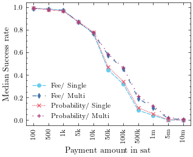
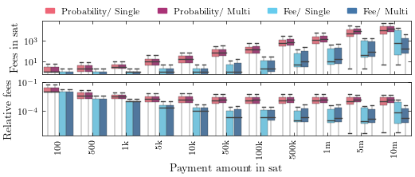
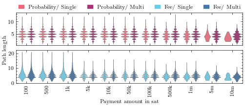
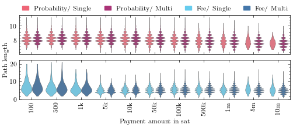
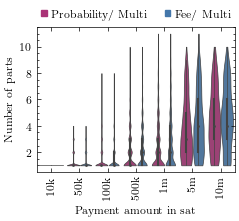
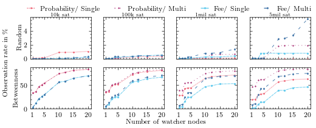
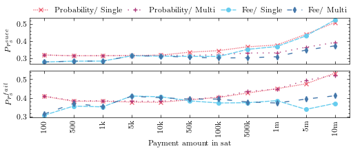
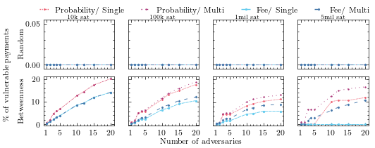
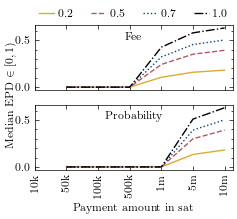

# lightning-simulator

This is a collection of projects related to simulating payments in the Lightning
network.

Each subproject contains a detailed description of the project itself along with
usage instructions.

## graph-diversity

A binary that does computations on the diversity in the LN channel graph.

## network-parser

A library to deserialise the channel graphs provided by either
[LND](https://lightning.engineering/api-docs/api/lnd/lightning/describe-graph/index.html)
or [lnresearch](https://github.com/lnresearch/topology).

## simulator

A binary that uses the `network-parser` to read the JSON files and simulate
payments in the LN.

## Build

Build all members of the project:

`cargo build --release`

## Simulation results

Here are the results of a series of simulations conducted on a snapshot of the
network on 2023-05-16.

  
<b>Performance</b>

   

   

   

   

   

   

  
<b>Privacy</b>

   

   

   

   

